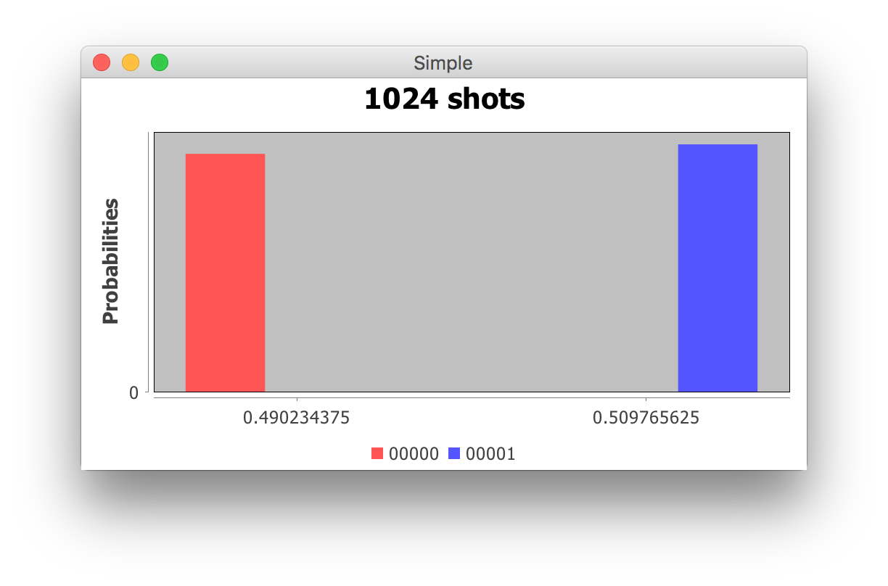
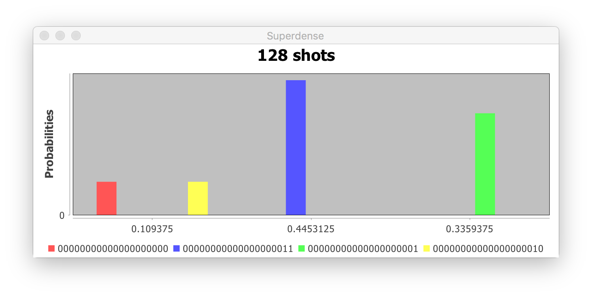
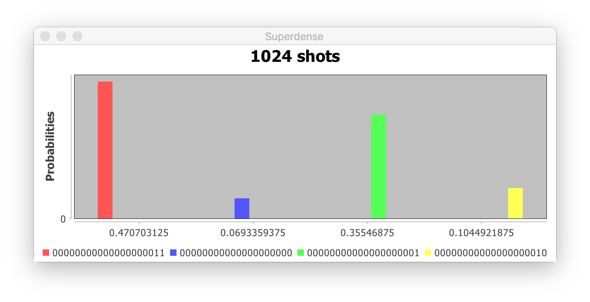

# Qiskit with Java
Quantum computing with Qiskit services.

## Configuration
Switch between qx and qc by setting the ENVIRONMENT variable. The default is qx.

The API token has to be provided.

    qx {
        // will be used where ENVIRONMENT="qx"
        url: "https://quantumexperience.ng.bluemix.net/api"
        loginPath: "/users/loginWithToken/"
        token: ""
        jobsPath: "/Jobs/"
        backend: "simulator"
      }
      
## Example tests
Run QasmRunTest. A simple QASM script, as well as superdense coding and quantum 
teleportation are included as samples.

Example input:

    OPENQASM 2.0;
    include "qelib1.inc";
    qreg q[5];
    creg c[5];
    
    h q[0];
    measure q[0] -> c[0];
 
Example output:

    {
      "deleted": false,
      "backend": {
        "name": "simulator"
      },
      "id": "d32a724abd57b4d42641511bf740416f",
      "shots": 128,
      "usedCredits": 0,
      "creationDate": "2018-03-31T15:22:25.162Z",
      "userId": "2cddbe2751b3161f6a8f33abd15b5b95",
      "calibration": {},
      "maxCredits": 3,
      "qasms": [
        {
          "result": {
            "date": "2018-03-31T15:22:25.431Z",
            "data": {
              "creg_labels": "c[5]",
              "counts": {
                "00000": 76,
                "00001": 52
              },
              "additionalData": {
                "seed": 653237722
              },
              "time": 0.00155116
            }
          },
          "executionId": "3c1502788a4d24391860c2396ec22066",
          "qasm": "include \"qelib1.inc\";qreg q[5];creg c[5];h q[0];measure q[0] -> c[0];",
          "status": "DONE"
        }
      ],
      "status": "COMPLETED"
    }
    
## Charts

 

## Simulator
A local simulator is also provided. 
SuperdenseCodingTest gives a usage sample.

    22:29:33.292 [main] INFO  l.simulator.circuit.SuperdenseCoding - Encoding Number: 125
    22:29:33.302 [main] INFO  l.simulator.circuit.SuperdenseCoding - Start State: |00000000>
     |
     v
    22:29:33.302 [main] INFO  l.simulator.circuit.SuperdenseCoding - Progress -- 0/4
    22:29:34.712 [main] INFO  l.simulator.circuit.SuperdenseCoding - IN: 125
    22:29:34.970 [main] INFO  l.simulator.circuit.SuperdenseCoding - Progress -- 1/4
    22:29:34.970 [main] INFO  l.simulator.circuit.SuperdenseCoding - IN: 31
    22:29:35.414 [main] INFO  l.simulator.circuit.SuperdenseCoding - Progress -- 2/4
    22:29:35.414 [main] INFO  l.simulator.circuit.SuperdenseCoding - IN: 7
    22:29:35.802 [main] INFO  l.simulator.circuit.SuperdenseCoding - Progress -- 3/4
    22:29:35.802 [main] INFO  l.simulator.circuit.SuperdenseCoding - IN: 1
    22:29:35.965 [main] INFO  l.simulator.circuit.SuperdenseCoding - Progress -- 4/4
    22:29:35.968 [main] INFO  l.simulator.circuit.SuperdenseCoding - 
     |
     v
    22:29:35.968 [main] INFO  l.simulator.circuit.SuperdenseCoding - Final State: |01111101>
    22:29:35.968 [main] INFO  l.t.simulator.SuperdenseCodingTest - Decoded number: 125

## Credits
https://github.com/Zaba505/qiskit-sdk-java

https://github.com/paltaie/akka-spring-head2head

https://github.com/RoboNeo9/Java-Quantum-Computer-Simulator

